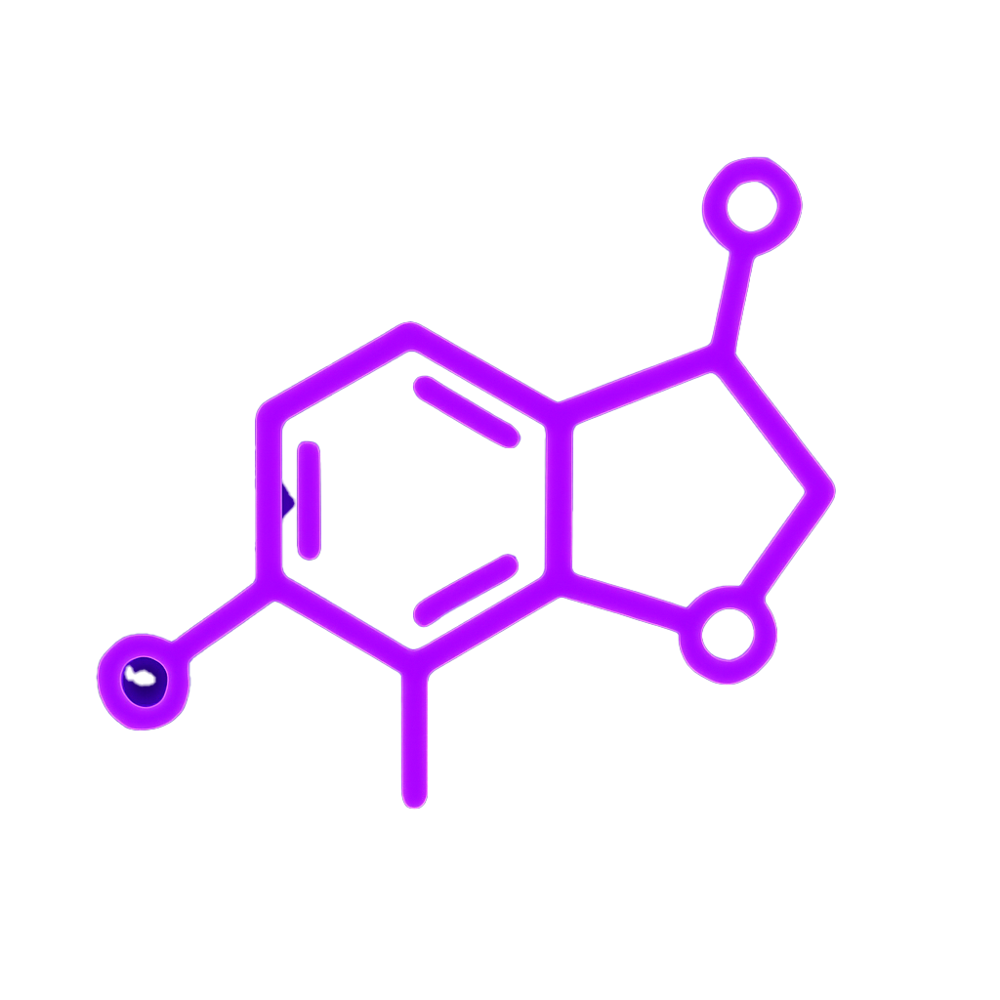

<div align="center">
  
  
  # 💜 ENDORPHIN
  
  ## اختبار E2E المُعاد اختراعه بالذكاء الاصطناعي
</div>

اكتب الاختبارات بالعربية البسيطة. دع الذكاء الاصطناعي يولدها ويتحقق منها ويصلحها
تلقائياً.

<div align="center">
  
  &nbsp;&nbsp;&nbsp;<strong>+</strong>&nbsp;&nbsp;&nbsp;
  
</div>

إطار عمل قوي ومعياري لأتمتة المتصفح باستخدام الاختبارات المدعومة بالذكاء
الاصطناعي مع LangChain وOpenAI GPT-4o وPlaywright. يوفر أتمتة متصفح ذكية مع كشف
تلقائي للعناصر والتحقق البصري وإدارة شاملة للاختبارات.

## 🎬 مشاهدة العرض التوضيحي

<div align="center">
  <a href="https://youtu.be/ev_71RBO6g8?si=F9xTPSJNp36Mr1wx" target="_blank">
    
  </a>
  <br />
  <p style="font-size: 18px; font-weight: bold; margin: 15px 0;">🎯 شاهد Endorphin AI في العمل - دليل شامل</p>
  <p style="font-size: 16px; color: #666; margin-bottom: 30px;">
    ✨ شاهد كيف يكتب الذكاء الاصطناعي وينفذ اختباراتك<br />
    🔍 اكتشف كشف العناصر الذكي في الوقت الفعلي<br />
    📊 استكشف تقارير HTML الجميلة مع لقطات الشاشة<br />
    ⚡ من الإعداد إلى تنفيذ الاختبار في 10 دقائق
  </p>
</div>

---

## 🚀 البدء السريع

### 📦 التثبيت والإعداد

ابدأ في أقل من 30 ثانية:

```bash
# ⚡ إعداد سريع (موصى به)
npx create-endorphin-ai@latest my-ai-tests
cd my-ai-tests
```

**أو الإعداد اليدوي:**

```bash
# 1. إنشاء مشروعك
mkdir my-ai-tests && cd my-ai-tests

# 2. تثبيت Endorphin AI
npm install endorphin-ai@latest --save-dev

# 3. التهيئة مع كل ما تحتاجه
npx endorphin-ai init
```

### 🔑 إضافة مفتاح OpenAI API

```bash
# تعديل ملف .env الذي تم إنشاؤه
echo "OPENAI_API_KEY=مفتاح-openai-api-هنا" > .env
```

### ▶️ تشغيل أول اختبار

```bash
# تشغيل اختبار فحص الصحة النموذجي
npx endorphin-ai run test HEALTH-001

# توليد تقرير HTML جميل
npx endorphin-ai generate report && npx endorphin-ai open report
```

## 🎯 الميزات الرئيسية

### 🤖 اختبارات مدعومة بالذكاء الاصطناعي

- **اكتب الاختبارات بالعربية البسيطة** - لا حاجة لمحددات معقدة
- **كشف ذكي للعناصر** - الذكاء الاصطناعي يجد الأزرار والنماذج والمحتوى تلقائياً
- **اختبارات ذاتية الإصلاح** - تتكيف مع تغييرات واجهة المستخدم دون انكسار
- **استرداد ذكي للأخطاء** - يعيد تلقائياً تجربة الإجراءات الفاشلة بإستراتيجيات
  مختلفة

### 📊 تقارير جميلة

- **تقارير HTML تفاعلية** مع لقطات الشاشة والتنفيذ خطوة بخطوة
- **تتبع التكاليف والرموز** - راقب استخدام الذكاء الاصطناعي وحسن النفقات
- **تاريخ قرارات الذكاء الاصطناعي** - انظر بالضبط كيف يحلل الذكاء الاصطناعي
  وينفذ الاختبارات
- **تصفية وبحث في الوقت الفعلي** للعثور على المشاكل بسرعة

### 🛠️ تجربة المطور

- **صفر تكوين** - يعمل فوراً
- **دعم TypeScript** مع تعريفات أنواع كاملة
- **هيكل اختبار ذكي** - إعداد ديناميكي وتوليد البيانات ودوال المهام
- **نظام أدوات مدمج** - 12 أداة أتمتة شاملة مضمنة

## 🔧 هيكل الاختبار الذكي

```typescript
import type { TestCase } from 'endorphin-ai';

export const SMART_TEST: TestCase = {
  id: 'LOGIN-001',
  name: 'اختبار تسجيل دخول المستخدم',
  description: 'اختبار تسجيل الدخول ببيانات الاعتماد المولدة',
  priority: 'High',
  tags: ['auth', 'smoke'],

  // توليد بيانات الاختبار ديناميكياً
  data: async () => {
    const timestamp = Date.now();
    return {
      email: `testuser${timestamp}@example.com`,
      password: 'SecurePassword123!',
      firstName: 'Test',
      lastName: 'User',
    };
  },

  // إعداد بيئة الاختبار
  setup: async () => {
    return {
      baseUrl: process.env.TEST_URL || 'https://example.com',
      startTime: new Date().toISOString(),
    };
  },

  // تعليمات الاختبار الرئيسية باستخدام البيانات المولدة
  task: async (data, setupData) => {
    return `
      انتقل إلى ${setupData.baseUrl}/login
      املأ حقل البريد الإلكتروني بـ "${data.email}"
      املأ حقل كلمة المرور بـ "${data.password}"
      انقر على زر الإرسال
      تحقق من أن رسالة الترحيب تحتوي على "${data.firstName}"
    `;
  },
};
```

## 📝 تنسيق ملف الاختبار

```typescript
import type { TestCase } from 'endorphin-ai';

export const QE001: TestCase = {
  id: 'QE-001',
  name: 'اختبار تسجيل دخول أساسي',
  description: 'اختبار وظيفة تسجيل الدخول ببيانات اعتماد صحيحة',
  priority: 'High',
  tags: ['authentication', 'login', 'smoke'],
  site: 'https://example.com/',
  data: async () => {
    return {
      email: 'test@example.com',
      password: 'password123',
    };
  },
  task: `تعليمات اختبارك بالعربية البسيطة...`,
};
```

## 🏆 لماذا تختار Endorphin AI؟

| الاختبار التقليدي                  | Endorphin AI                          |
| ---------------------------------- | ------------------------------------- |
| ❌ محددات CSS هشة                  | ✅ الذكاء الاصطناعي يجد العناصر بذكاء |
| ❌ ينكسر مع تغييرات واجهة المستخدم | ✅ اختبارات ذاتية الإصلاح             |
| ❌ إعداد معقد                      | ✅ صفر تكوين                          |
| ❌ صعب الصيانة                     | ✅ أوصاف الاختبار بالعربية البسيطة    |

## 🎮 مرجع CLI كامل

```bash
# تشغيل اختبار محدد
npx endorphin run test TEST-001

# تشغيل جميع الاختبارات
npx endorphin run test all

# تشغيل الاختبارات حسب العلامة
npx endorphin run test --tag smoke

# توليد تقرير HTML
npx endorphin generate report

# فتح التقرير
npx endorphin open report
```

## 🔄 البقاء محدثاً

```bash
# فحص الإصدار الحالي
npx endorphin-ai --version

# التحديث إلى أحدث إصدار
npm update endorphin-ai
```

---

<div align="center">
  <p><strong>⚡ اختبار سعيد!</strong></p>
</div>
