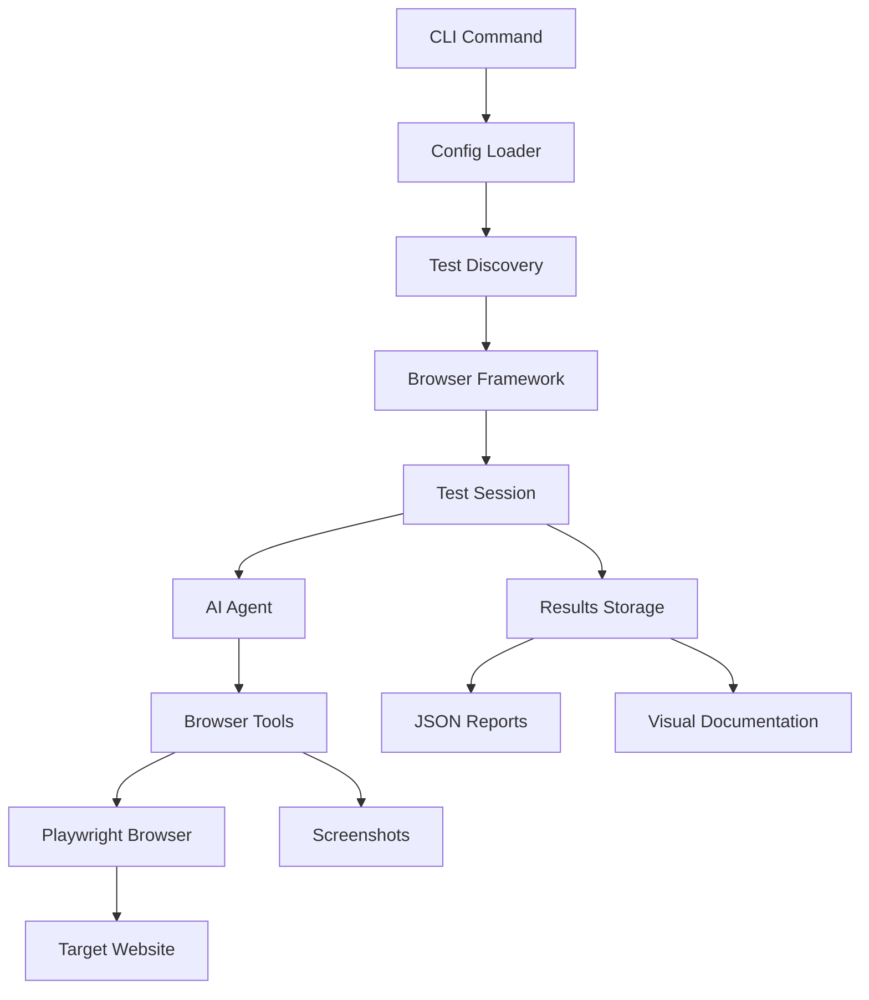

# 🏗️ Framework Architecture

## Overview

Endorphin AI is built with a modular architecture that separates concerns and provides clear interfaces between components. The framework is designed for extensibility, maintainability, and ease of testing.

## 📁 Directory Structure

```
framework/
├── test-framework.js            # Main entry point
├── index.js                     # Modular exports
├── config/                      # Configuration files
│   ├── agent-config.js          # AI agent settings
│   ├── browser-config.js        # Browser configuration
│   └── paths.js                 # Directory paths
├── core/                        # Core components
│   ├── browser-framework.js     # Main framework class
│   ├── config-loader.js         # Configuration management
│   ├── test-discovery.js        # Test discovery & execution
│   ├── test-manager.js          # Test management
│   ├── test-runner.js           # Test execution
│   └── test-session.js          # Session tracking
├── tools/                       # Browser automation tools
│   ├── navigation.js            # Page navigation
│   ├── interaction.js           # Clicks, form filling
│   ├── verification.js          # Element verification
│   ├── content.js               # Page content analysis
│   └── utilities.js             # Screenshots, waits
├── interactive/                 # Interactive testing tools
│   ├── enhanced-interactive-recorder.js
│   ├── interactive-test.js
│   └── index.js
└── testing/                     # Testing utilities
    ├── test-interactive-recorder.js
    ├── test-modular-framework.js
    └── verify-test-format.js
```

## 🧩 Core Components

### Main Entry Points

#### `test-framework.js`
- Primary framework entry point
- Orchestrates all components
- Provides high-level API for test execution

#### `index.js`
- Modular exports for framework components
- Allows selective importing of specific modules
- Provides clean API surface

### Configuration Layer

#### `config/agent-config.js`
- AI agent configuration settings
- OpenAI API parameters
- Model selection and behavior tuning
- Recursion limits and safety controls

#### `config/browser-config.js`
- Browser launch settings
- Viewport and display options
- Timeout configurations
- Screenshot and recording settings

#### `config/paths.js`
- Directory path definitions
- Test result storage locations
- Temporary file handling
- Cross-platform path resolution

### Core Framework

#### `core/browser-framework.js`
- Main framework class (`EnhancedBrowserTestFramework`)
- Browser lifecycle management
- Test execution orchestration
- Session management
- Result collection and storage

#### `core/config-loader.js`
- Configuration file loading and merging
- Environment variable integration
- CLI flag override handling
- Configuration validation

#### `core/test-discovery.js`
- Test file discovery and loading
- Test filtering by tags/priority
- Dynamic test import handling
- Test validation

#### `core/test-session.js`
- Test session lifecycle management
- Step tracking and logging
- Result aggregation
- Screenshot coordination

### Browser Automation Tools

#### `tools/navigation.js`
- Page navigation utilities
- URL handling and validation
- Wait conditions for page loads
- History management

#### `tools/interaction.js`
- Element interaction (click, type, select)
- Form handling and validation
- Input focus management
- Event simulation

#### `tools/verification.js`
- Element existence and visibility checks
- Content validation
- State verification
- Assertion helpers

#### `tools/content.js`
- Page content analysis
- HTML parsing and extraction
- Element discovery
- Text content validation

#### `tools/utilities.js`
- Screenshot capture
- Wait and delay utilities
- File I/O operations
- Error handling helpers

## 🔄 Data Flow



## 🎯 Design Principles

### Modularity
- Each component has a single responsibility
- Clear interfaces between modules
- Easy to test and maintain
- Supports selective importing

### Extensibility
- Plugin-friendly architecture
- Easy to add new browser tools
- Configurable AI agent behavior
- Customizable test execution flow

### Reliability
- Comprehensive error handling
- Retry mechanisms for flaky operations
- Graceful degradation
- Resource cleanup

### Observability
- Detailed logging at every level
- Visual documentation (screenshots)
- Structured result formats
- Performance tracking

## 🔧 Configuration System

### Configuration Hierarchy
1. **Default Configuration** (built-in)
2. **Environment Variables** (`.env` file)
3. **User Config File** (`endorphin.config.js`)
4. **CLI Flags** (command-line overrides)

### Configuration Merging
```javascript
// Example of configuration merging
const finalConfig = merge(
  defaultConfig,
  environmentConfig,
  userConfig,
  cliFlags
);
```

## 🧪 Testing Strategy

### Framework Tests
- Unit tests for individual components
- Integration tests for component interaction
- End-to-end tests for complete workflows
- Performance benchmarks

### Test Discovery
- Automatic test file detection
- Dynamic ES module loading
- Test validation and filtering
- Error handling for malformed tests

## 🚀 Execution Flow

### 1. Initialization
```
CLI → Config Loading → Test Discovery → Framework Setup
```

### 2. Test Execution
```
Test Selection → Session Start → AI Agent → Browser Actions → Result Collection
```

### 3. Cleanup
```
Session End → Resource Cleanup → Report Generation → File Storage
```

## 🔌 Extension Points

### Custom Tools
Add new browser automation tools by implementing the tool interface:

```javascript
export class CustomTool {
  constructor(page, session) {
    this.page = page;
    this.session = session;
  }
  
  async execute(action) {
    // Custom tool implementation
  }
}
```

### Custom Reporters
Implement custom result reporting:

```javascript
export class CustomReporter {
  async generateReport(session, results) {
    // Custom reporting logic
  }
}
```

### AI Agent Customization
Extend AI agent behavior:

```javascript
export class CustomAgent extends BaseAgent {
  async processTask(task, context) {
    // Custom AI processing
  }
}
```

## 📦 Dependencies

### Core Dependencies
- **Playwright**: Browser automation
- **OpenAI**: AI agent functionality
- **LangChain**: AI tool integration

### Development Dependencies
- **Vitest**: Testing framework
- **ESLint**: Code quality
- **Prettier**: Code formatting

## 🛠️ Development Guidelines

### Adding New Features
1. Follow the modular architecture
2. Add comprehensive tests
3. Update documentation
4. Maintain backward compatibility

### Code Style
- Use ES6+ modules
- Prefer async/await over promises
- Include JSDoc comments
- Follow consistent naming conventions

### Error Handling
- Use try/catch blocks consistently
- Provide meaningful error messages
- Log errors with context
- Implement retry logic where appropriate

This architecture provides a solid foundation for building reliable, scalable browser automation tests with AI assistance.
