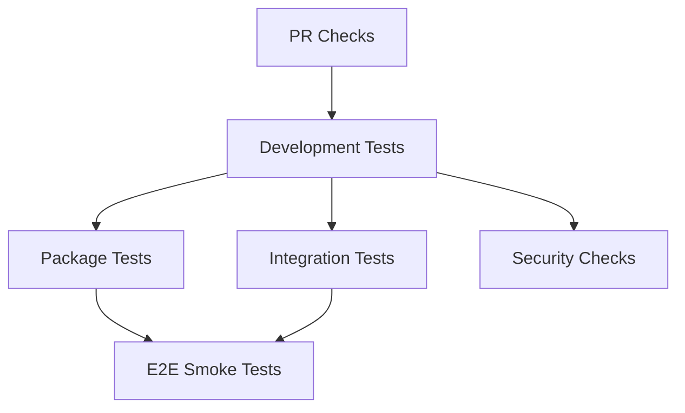

# CI/CD Guide - Endorphin AI

_Last Updated: June 28, 2025 - v0.5.0_

## Overview

Endorphin AI uses a comprehensive CI/CD pipeline with GitHub Actions to ensure code quality, functionality, and reliability across different environments and use cases.

## Workflow Structure

### 1. PR Checks (`pr-checks.yml`)
**Trigger**: Every pull request to `main` or `develop`
**Purpose**: Fast feedback for development

#### Jobs:
- **Quick Checks**: TypeScript compilation, linting, basic tests
- **Documentation Check**: Ensures docs are updated with code changes
- **Security Scan**: Basic security audit and secret detection

#### Duration: ~3-5 minutes

### 2. CI Tests (`ci.yml`)
**Trigger**: Push to `main`/`develop` and pull requests
**Purpose**: Comprehensive testing and validation

#### Jobs:

##### Development Tests
- TypeScript type checking
- ESLint linting
- Jest unit and integration tests (108 tests)
- Test coverage upload

##### Package Tests
- Build verification
- End-to-end package testing
- User workflow simulation
- Real CLI command testing
- Requires OpenAI API key for full testing

##### Integration Tests (Matrix)
- **Operating Systems**: Ubuntu, Windows, macOS
- **Node.js Versions**: 18, 20, 22
- Cross-platform CLI testing
- Build verification across platforms

##### Security & Quality
- npm audit for vulnerabilities
- Dependency freshness check
- Package validation

##### E2E Smoke Tests
- **Trigger**: Only on push to `develop`
- Real browser automation test
- Health check with OpenAI integration
- Full workflow validation

## Test Categories

### 1. Development Tests (`npm test`)
**Location**: `tests/development/`
**Framework**: Jest
**Purpose**: Framework development validation

```bash
# Run locally
npm test
npm run test:unit
npm run test:integration
```

**Coverage**:
- Unit tests for individual components
- Integration tests for workflows
- TypeScript source testing
- Mock-based (no real browser/API calls)

### 2. Package Tests (`npm run test:package`)
**Location**: `tests/package-tests/`
**Framework**: Bash scripts
**Purpose**: User experience validation

```bash
# Run locally
npm run test:package
```

**Coverage**:
- Package installation simulation
- CLI command functionality
- File isolation verification
- Real workflow testing
- User project setup

### 3. Integration Tests
**Purpose**: Cross-platform compatibility
**Coverage**:
- Multiple Node.js versions
- Different operating systems
- CLI functionality verification
- Build artifact validation

### 4. E2E Smoke Tests
**Purpose**: End-to-end validation
**Coverage**:
- Real browser automation
- OpenAI API integration
- Complete user workflow
- Production-like environment

## Environment Variables

### Required Secrets
```yaml
OPENAI_API_KEY: # Required for package tests and E2E tests
```

### CI Environment Variables
```yaml
CI: true                    # Indicates CI environment
TEST_TIMEOUT: 300          # Test timeout in seconds
```

## Local Development

### Quick Development Check
```bash
# What runs on every PR
npm run type-check
npm run lint
npm run build
npm test
```

### Full Local Testing
```bash
# Complete test suite
npm test                    # Development tests
npm run test:package        # Package tests (requires API key)
npm run test:local          # Build + package tests
```

### Test Individual Components
```bash
# TypeScript only
npm run type-check

# Linting only  
npm run lint

# Unit tests only
npm run test:unit

# Integration tests only
npm run test:integration

# Build verification
npm run build
node dist/bin/endorphin.js --version
```

## Workflow Dependencies



### Job Dependencies:
- **Package Tests** depend on **Development Tests**
- **Integration Tests** depend on **Development Tests** 
- **E2E Smoke Tests** depend on **Development Tests** + **Package Tests**
- **Security Checks** run independently

## Performance Optimization

### Matrix Strategy
Integration tests use a matrix but exclude some combinations:
- Windows/Node 18 (excluded)
- macOS/Node 18 (excluded)
- Reduces CI time while maintaining coverage

### Parallel Execution
- Development tests run in parallel with security checks
- Integration tests run in parallel across matrix
- Package tests run sequentially (require environment setup)

### Timeouts
- Package tests: 20 minutes maximum
- E2E smoke tests: 5 minutes maximum
- Other jobs: Default GitHub timeout (6 hours)

## Artifacts

### Test Coverage
- **Path**: `tests/development/coverage/`
- **Upload**: Always (on development-tests job)
- **Retention**: 90 days

### Package Test Results
- **Path**: `tests/package-tests/results/`
- **Upload**: Always (on package-tests job)
- **Includes**: Logs, HTML reports, session data

### E2E Test Results  
- **Path**: `/tmp/e2e-test/test-results/`
- **Upload**: Always (on e2e-smoke-tests job)
- **Includes**: Screenshots, test sessions, reports

## Debugging CI Failures

### Development Test Failures
```bash
# Reproduce locally
npm test

# Check specific test
npm test -- --testNamePattern="specific test name"

# With verbose output
npm test -- --verbose
```

### Package Test Failures
```bash
# Full package test locally
npm run test:package

# Check specific category
cd tests/package-tests
./scripts/runner/run-test.sh

# View results
./view-results.sh
```

### Build Failures
```bash
# Check TypeScript compilation
npm run type-check

# Check build process
npm run build

# Verify artifacts
ls -la dist/
node dist/bin/endorphin.js --version
```

### Integration Test Failures
Check the specific OS/Node combination that failed:
- Download artifacts from GitHub Actions
- Check CLI command execution logs
- Verify platform-specific path handling

## Best Practices

### For Contributors

1. **Run PR checks locally** before pushing:
   ```bash
   npm run type-check && npm run lint && npm run build && npm test
   ```

2. **Update documentation** with code changes

3. **Test package changes** locally:
   ```bash
   npm run test:local
   ```

4. **Check cross-platform compatibility** for CLI changes

### For Maintainers

1. **Monitor CI performance** - optimize if jobs take too long

2. **Update dependencies** regularly:
   ```bash
   npm outdated
   npm audit
   ```

3. **Review security scans** and address findings

4. **Maintain test environment** variables and secrets

### For Release Process

1. **All CI jobs must pass** before merging to main

2. **Package tests validate** user experience

3. **E2E tests confirm** real-world functionality

4. **Security scans ensure** no vulnerabilities

## Troubleshooting

### Common Issues

#### Package Tests Timeout
- Check OpenAI API key availability
- Verify network connectivity in CI
- Review test complexity and duration

#### Integration Test Failures
- **Windows compatibility**: Uses bash shell and simplified Jest commands
- **Coverage issues**: Integration tests run without coverage to avoid threshold conflicts
- **Node.js version compatibility**: Tests across 18, 20, 22
- **Cross-platform paths**: All paths use forward slashes (Node.js compatible)

#### Build Artifact Issues
- Verify TypeScript compilation
- Check path alias resolution
- Confirm template file copying

#### Flaky Tests
- Add proper waits and timeouts
- Improve test isolation
- Use deterministic test data

### Debug Commands

```bash
# Check CI environment locally
CI=true npm test

# Test integration tests specifically
npm run test:integration

# Test unit tests only
npm run test:unit

# Simulate package test environment
mkdir /tmp/test-env
cd /tmp/test-env
# Run package tests

# Check build artifacts
npm run build
find dist/ -type f | head -20

# Verify CLI functionality
node dist/bin/endorphin.js --help
node dist/bin/endorphin.js --version

# Windows-specific debugging
# Ensure bash is available and paths work
which bash
node dist/bin/endorphin.js --help
```

## Future Improvements

### Planned Enhancements
- **Performance testing** integration
- **Visual regression testing** for HTML reports
- **Automated dependency updates** with Dependabot
- **Release automation** with semantic versioning

### Monitoring
- **Test execution metrics** tracking
- **CI performance** optimization
- **Flaky test detection** and resolution
- **Coverage trending** analysis

---

This CI/CD setup ensures **high-quality releases** with **comprehensive testing** across **multiple environments** while maintaining **fast feedback loops** for development.